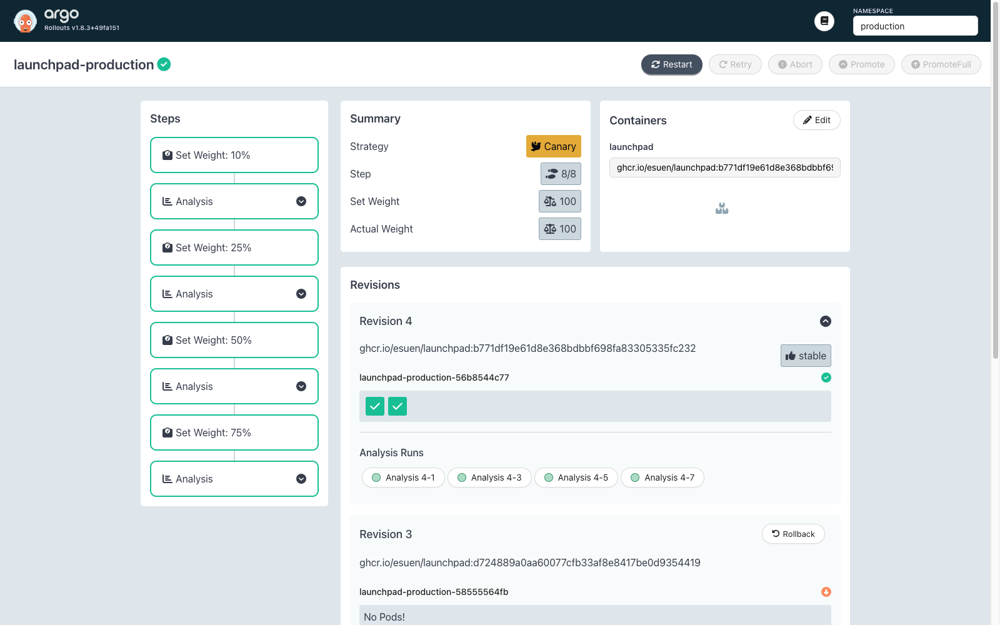
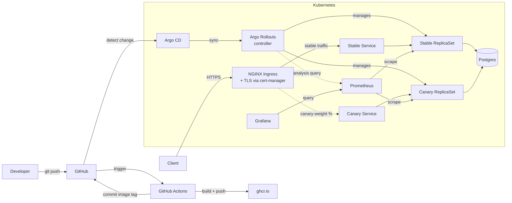
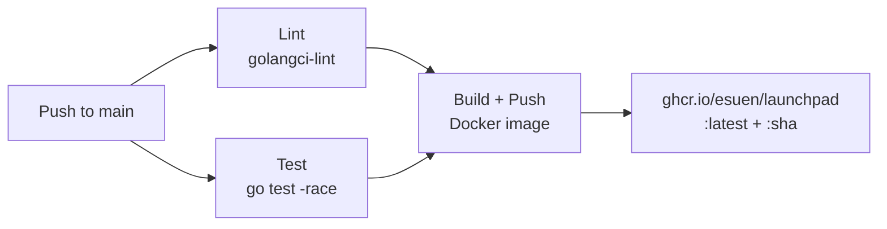
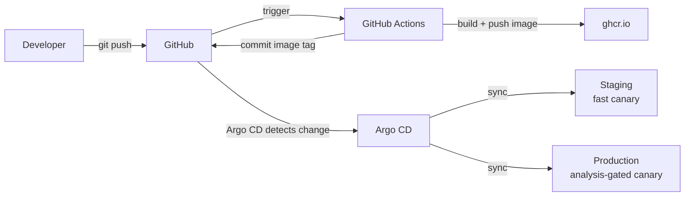

# Launchpad

A deployment tracker API built with Go, deployed to Kubernetes via GitOps with **analysis-gated progressive delivery**. Demonstrates a production-shaped cloud-native architecture: Argo CD for declarative deployments, Argo Rollouts for canary releases with Prometheus-gated promotion, CI/CD with GitHub Actions, Helm-based configuration, Postgres, TLS ingress, and full observability with Prometheus and Grafana.

## GitOps


## Observability


## Progressive Delivery



Releases use [Argo Rollouts](https://argoproj.github.io/argo-rollouts/) with **NGINX ingress-based traffic splitting** instead of plain Deployment rolling updates. Each environment runs a different canary strategy:

| Environment | Cadence | Gate |
|---|---|---|
| Staging | `50% → 15s → 100%` (~90s total) | Duration-based pause |
| Production | `10% → 25% → 50% → 75% → 100%` | Prometheus AnalysisTemplate at each step |

Production canary advancement is gated on a Prometheus query checking the **canary pods' HTTP success rate** (filtered by `rollouts_pod_template_hash`) — the rollout self-promotes on healthy metrics and self-aborts on regressions, with no human in the loop.

### How NGINX traffic splitting works

The chart declares two Services (`launchpad-production` stable + `launchpad-production-canary`) with identical selectors. The Argo Rollouts controller mutates each Service's selector at runtime, adding a `rollouts-pod-template-hash` label that pins one Service to the stable ReplicaSet and the other to the canary ReplicaSet.

During a rollout, the controller dynamically creates a second NGINX Ingress copying the stable's spec, swapping its backend to the canary Service, and adding `nginx.ingress.kubernetes.io/canary: "true"` plus a `canary-weight` annotation. As each `setWeight` step fires, the controller updates the annotation value (e.g. `25` → `50`) and NGINX shifts request-level traffic accordingly.

This works for HTTP/2 and gRPC because the routing decision happens at request-time (the ingress proxy) rather than connect-time (kube-proxy). With a pod-ratio canary, a long-lived gRPC connection would pin to one pod for its lifetime — defeating the gradual rollout. With L7 traffic splitting, every RPC over the persistent connection gets routed independently.

### Analysis query

```promql
sum(rate(http_requests_total{
  namespace="production",
  rollouts_pod_template_hash="<canary-hash>",
  status!~"5.."
}[2m]))
/
sum(rate(http_requests_total{
  namespace="production",
  rollouts_pod_template_hash="<canary-hash>"
}[2m])) or vector(1)
```

The `rollouts_pod_template_hash` label is surfaced on all metrics by Prometheus's default Kubernetes pod scrape. The Rollout passes the canary's hash into the AnalysisTemplate at runtime via `valueFrom.podTemplateHashValue: Latest`.

The trailing `or vector(1)` is a defensive fallback: in the first ~60s after a canary pod comes up, Prometheus hasn't scraped it enough times for `rate(...[2m])` to produce a value. Without the fallback, Argo Rollouts' `result[0]` indexing panics on the empty result vector. The analysis also waits a 60s `initialDelay` before its first measurement to give Prometheus time to discover and scrape the new pod.

### What happens during a regression

If a measurement fails the success threshold, Argo Rollouts marks the AnalysisRun Failed and the Rollout transitions to `Degraded`:

1. **Traffic flip is instant** — canary Ingress weight drops to 0; in-flight requests on canary pods complete normally.
2. **Stable continues serving uninterrupted** — no pods are restarted, no race with kube-proxy iptables propagation.
3. **Canary pods stay alive** — available for `kubectl exec`, log inspection, or heap dumps before being scaled down. The forensic trail is preserved.

The rollback mechanism never introduces user-visible errors.

### Lesson: defensive PromQL for fresh canaries

The first production canary using the analysis-gated flow failed within ~50 seconds. The AnalysisRun reported `consecutiveErrors (5) > consecutiveErrorLimit (4)` with the message `reflect: slice index out of range`. The PromQL was valid and the canary pod was healthy — both stable and canary pods returned 200 to every probe — but Argo Rollouts panicked when evaluating `successCondition: result[0] >= 0.95`.

Root cause: in the first ~60s after a canary pod comes up, Prometheus's pod scrape hasn't run enough times for `rate(http_requests_total[1m])` to produce a value. The query returned an empty result vector, and `result[0]` on an empty vector panics. Argo Rollouts catches the panic, logs the error, retries 4 more times at 10s intervals (faster than the configured `interval: 30s` because retries use a separate cadence), then fails the analysis. The canary aborted at step 1 with the new image never actually serving production traffic.

Three changes made the analysis robust to fresh pods:

1. **`initialDelay: 60s`** — wait one minute before the first measurement, giving Prometheus time to discover the canary pod and complete at least two scrapes.
2. **Widen the rate window** from `[1m]` to `[2m]` — tolerates the sparse early data.
3. **Add `or vector(1)`** to the end of the query — returns 1 (passes the threshold) when the main expression yields no data. The genuinely-no-traffic case shouldn't fail the canary; it should be ignored until traffic arrives.

The failed `AnalysisRun` is still visible in the cluster's history (`kubectl get analysisruns -n production` shows the original resource with phase `Error` alongside the successful ones). Keeping the artifact makes the failure mode discoverable for future debugging.

## Architecture



## CI/CD Pipeline



## API

| Method | Path | Description |
|--------|------|-------------|
| `POST` | `/api/v1/deployments/` | Create a deployment record |
| `GET` | `/api/v1/deployments/` | List deployments (filter: `?service=`, `?environment=`) |
| `GET` | `/api/v1/deployments/{id}` | Get a deployment by ID |
| `GET` | `/healthz` | Liveness probe |
| `GET` | `/readyz` | Readiness probe |
| `GET` | `/metrics` | Prometheus metrics |

### Example

```bash
# Create a deployment
curl -sk -X POST https://launchpad.local/api/v1/deployments/ \
  -H "Content-Type: application/json" \
  -d '{"service_name":"api-server","version":"v1.0.0","environment":"production"}'

# List deployments
curl -sk https://launchpad.local/api/v1/deployments/

# Filter by environment
curl -sk https://launchpad.local/api/v1/deployments/?environment=production
```

## Project Structure

```
├── cmd/server/              # Entrypoint, config, graceful shutdown
├── internal/
│   ├── database/            # Postgres connection, migrations
│   │   └── migrations/      # SQL migration files
│   ├── model/               # Domain types (Deployment, status constants)
│   ├── server/              # HTTP handlers, middleware, routing
│   └── store/               # Store interface, Postgres + in-memory implementations
├── deploy/
│   ├── argocd/              # Argo CD Application resources (staging + production)
│   ├── helm/launchpad/      # Helm chart (Rollout, AnalysisTemplate, stable+canary Services, Ingress, Secret, ConfigMap)
│   ├── clusterissuer.yaml   # cert-manager TLS issuer (cluster-scoped)
│   ├── kind-config.yaml     # kind cluster config with ingress port mappings
│   └── grafana-dashboard.json
├── .github/workflows/       # CI pipeline
├── Dockerfile               # Multi-stage build (golang:alpine → alpine)
└── Makefile                 # Build, test, lint, docker, helm, observability targets
```

## Getting Started

### Prerequisites

- Go 1.25+
- Docker
- kind
- kubectl
- Helm
- kubectl-argo-rollouts plugin (`brew install argoproj/tap/kubectl-argo-rollouts`)

### Deploy to kind

```bash
# Create cluster with ingress support
kind create cluster --name launchpad --config deploy/kind-config.yaml

# Install infrastructure
helm repo add bitnami https://charts.bitnami.com/bitnami
helm repo add prometheus-community https://prometheus-community.github.io/helm-charts
helm repo add grafana https://grafana.github.io/helm-charts
helm repo update

# Install NGINX ingress controller
kubectl apply -f https://raw.githubusercontent.com/kubernetes/ingress-nginx/main/deploy/static/provider/kind/deploy.yaml

# Install cert-manager
kubectl apply -f https://github.com/cert-manager/cert-manager/releases/download/v1.17.2/cert-manager.yaml

# Install Postgres
helm install postgresql bitnami/postgresql \
  --set auth.username=launchpad --set auth.password=launchpad --set auth.database=launchpad

# Install Prometheus
helm install prometheus prometheus-community/prometheus \
  --set alertmanager.enabled=false --set prometheus-node-exporter.enabled=false \
  --set prometheus-pushgateway.enabled=false --set kube-state-metrics.enabled=false

# Install Grafana
helm install grafana grafana/grafana --set adminPassword=admin \
  --set persistence.enabled=false \
  --set datasources."datasources\.yaml".apiVersion=1 \
  --set datasources."datasources\.yaml".datasources[0].name=Prometheus \
  --set datasources."datasources\.yaml".datasources[0].type=prometheus \
  --set datasources."datasources\.yaml".datasources[0].url=http://prometheus-server \
  --set datasources."datasources\.yaml".datasources[0].access=proxy \
  --set datasources."datasources\.yaml".datasources[0].isDefault=true

# Install Argo CD
kubectl create namespace argocd
kubectl apply -n argocd -f https://raw.githubusercontent.com/argoproj/argo-cd/stable/manifests/install.yaml --server-side --force-conflicts

# Install Argo Rollouts (controller pinned to v1.9.0)
kubectl create namespace argo-rollouts
kubectl apply -n argo-rollouts -f https://github.com/argoproj/argo-rollouts/releases/download/v1.9.0/install.yaml --server-side --force-conflicts

# Build and load app image
make docker-build
kind load docker-image ghcr.io/esuen/launchpad:latest --name launchpad

# Apply standalone resources
kubectl create namespace staging
kubectl create namespace production
kubectl apply -f deploy/clusterissuer.yaml

# Deploy via Argo CD
kubectl apply -f deploy/argocd/launchpad-staging.yaml
kubectl apply -f deploy/argocd/launchpad-production.yaml

# Add hosts entries (requires sudo)
echo '127.0.0.1 launchpad.local' | sudo tee -a /etc/hosts
echo '127.0.0.1 staging.launchpad.local' | sudo tee -a /etc/hosts

# Verify
curl -sk https://launchpad.local/healthz
curl -sk https://staging.launchpad.local/healthz
```

### Run Locally (no Kubernetes)

```bash
make run  # starts with in-memory store (no Postgres needed)
```

### Run Tests

```bash
make test
```

### All Make Targets

| Target | Description |
|--------|-------------|
| `make build` | Build Go binary |
| `make run` | Run locally |
| `make test` | Run tests with race detector |
| `make lint` | Run golangci-lint |
| `make docker-build` | Build Docker image |
| `make docker-run` | Run Docker container locally |
| `make helm-lint` | Lint Helm chart |
| `make helm-template` | Render Helm templates |
| `make helm-install` | Deploy to current K8s context |
| `make helm-uninstall` | Remove from K8s |
| `make grafana` | Port-forward Grafana (http://localhost:3000) |
| `make prometheus` | Port-forward Prometheus (http://localhost:9090) |
| `make argocd` | Port-forward Argo CD UI (https://localhost:8443) |
| `make rollouts-dashboard` | Open Argo Rollouts dashboard (http://localhost:3100) |

## GitOps Deployment Flow



Argo CD watches the repo and automatically syncs both environments when the Helm chart or values files change. CI builds the image, pushes it to ghcr.io, then commits the new image tag back to git — Argo CD picks up the commit and triggers an Argo Rollouts canary. Staging auto-promotes in ~90 seconds. Production progresses through four Prometheus-gated steps and auto-promotes only if every step's success-rate query passes.

### Environments

| Environment | Namespace | Host | Replicas | Values file | Canary strategy |
|-------------|-----------|------|----------|-------------|-----------------|
| Staging | `staging` | `staging.launchpad.local` | 1 | `values-staging.yaml` | Fast, duration-paused |
| Production | `production` | `launchpad.local` | 2 | `values-production.yaml` | Gradual, Prometheus-gated |

## Production vs Local Tradeoffs

This project runs locally on kind. In a production environment, you'd make these changes:

| Component | Local (this project) | Production |
|-----------|---------------------|------------|
| Kubernetes | kind (single node) | Managed K8s (EKS, GKE, AKS) |
| Container registry | ghcr.io | ECR, GCR, or private registry |
| TLS certificates | Self-signed (cert-manager) | Let's Encrypt via cert-manager (same setup, swap ClusterIssuer) |
| Database | Postgres in-cluster (Bitnami Helm chart) | Managed database (RDS, Cloud SQL) |
| Secrets | Kubernetes Secrets (base64) | Sealed Secrets, External Secrets Operator, or Vault |
| Environments | Namespaces in same cluster | Separate clusters per environment |
| DNS | /etc/hosts entries | Real DNS (Route 53, Cloud DNS) |
| Observability | Self-hosted Prometheus + Grafana | Datadog, Grafana Cloud, or managed Prometheus |
| Image pull | `kind load` for initial setup, then pulls from ghcr.io | Pull from private registry (ECR, GCR) with auth |
| Argo CD access | port-forward | Ingress with SSO/OAuth |
| GitOps sync | Polling (3 min interval) | GitHub webhook for near-instant sync |
| Deployment strategy | Argo Rollouts canary, analysis queries in-cluster Prometheus | Same Rollouts setup; analysis can fan out to multiple metrics (latency p99, error-budget burn) and providers (DataDog, managed Prometheus) |
| Canary traffic splitting | NGINX Ingress canary annotations | Same NGINX setup; or service mesh (Istio/Linkerd) for L7 features like header-based routing and same-session stickiness |

The architecture and patterns are identical — managed services replace self-hosted components for operational efficiency.

## Roadmap

- **Phase 1**: Go API, Docker, Helm, kind, GitHub Actions CI
- **Phase 2**: Postgres, ingress + TLS, secrets, Prometheus + Grafana
- **Phase 3**: Argo CD, GitOps deployment flow, environment separation
- **Phase 4** (current): Argo Rollouts canary with NGINX traffic splitting, Prometheus-gated analysis
- **Phase 5**: Policy enforcement (Kyverno), OpenTelemetry tracing, multi-service coordination
