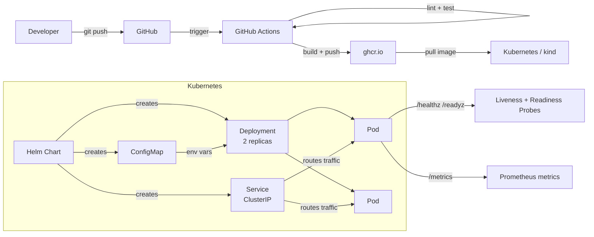
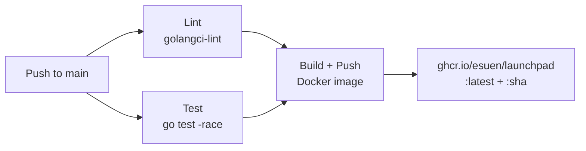

# Launchpad

A deployment tracker API built with Go, deployed to Kubernetes. Demonstrates a production-shaped cloud-native architecture: CI/CD, containerization, Helm-based deployment, health checks, Prometheus metrics, and structured logging.

## Architecture



## CI/CD Pipeline



## API

| Method | Path | Description |
|--------|------|-------------|
| `POST` | `/api/v1/deployments/` | Create a deployment record |
| `GET` | `/api/v1/deployments/` | List deployments (filter: `?service=`, `?environment=`) |
| `GET` | `/api/v1/deployments/{id}` | Get a deployment by ID |
| `GET` | `/healthz` | Liveness probe |
| `GET` | `/readyz` | Readiness probe |
| `GET` | `/metrics` | Prometheus metrics |

### Example

```bash
# Create a deployment
curl -X POST localhost:8080/api/v1/deployments/ \
  -H "Content-Type: application/json" \
  -d '{"service_name":"api-server","version":"v1.0.0","environment":"production"}'

# List deployments
curl localhost:8080/api/v1/deployments/

# Filter by environment
curl localhost:8080/api/v1/deployments/?environment=production
```

## Project Structure

```
├── cmd/server/          # Entrypoint, config, graceful shutdown
├── internal/
│   ├── model/           # Domain types (Deployment, status constants)
│   ├── server/          # HTTP handlers, middleware, routing
│   └── store/           # In-memory deployment store
├── deploy/helm/         # Helm chart (Deployment, Service, ConfigMap)
├── .github/workflows/   # CI pipeline
├── Dockerfile           # Multi-stage build (golang:alpine → alpine)
└── Makefile             # Build, test, lint, docker, helm targets
```

## Getting Started

### Prerequisites

- Go 1.25+
- Docker
- kind
- kubectl
- Helm

### Run Locally

```bash
make run
```

### Run Tests

```bash
make test
```

### Deploy to kind

```bash
# Create cluster
kind create cluster --name launchpad

# Build and load image
make docker-build
kind load docker-image ghcr.io/esuen/launchpad:latest --name launchpad

# Deploy
make helm-install

# Verify
kubectl get pods -l app=launchpad

# Access the API
kubectl port-forward svc/launchpad 8080:80
curl localhost:8080/healthz
```

### All Make Targets

| Target | Description |
|--------|-------------|
| `make build` | Build Go binary |
| `make run` | Run locally |
| `make test` | Run tests with race detector |
| `make lint` | Run golangci-lint |
| `make docker-build` | Build Docker image |
| `make docker-run` | Run Docker container locally |
| `make helm-lint` | Lint Helm chart |
| `make helm-template` | Render Helm templates |
| `make helm-install` | Deploy to current K8s context |
| `make helm-uninstall` | Remove from K8s |

## Roadmap

- **Phase 1** (current): Go API, Docker, Helm, kind, GitHub Actions CI
- **Phase 2**: Postgres, ingress, TLS, secrets management, Prometheus + Grafana
- **Phase 3**: Argo CD, GitOps deployment flow
- **Phase 4**: Argo Rollouts, policy enforcement, OpenTelemetry
