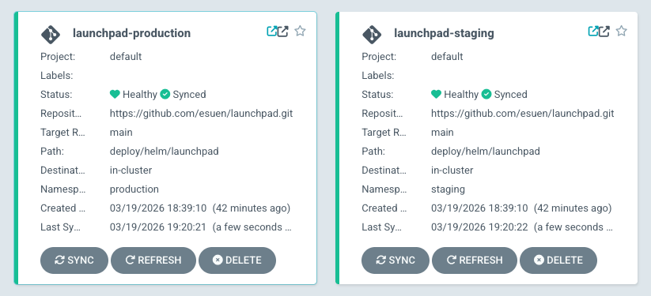
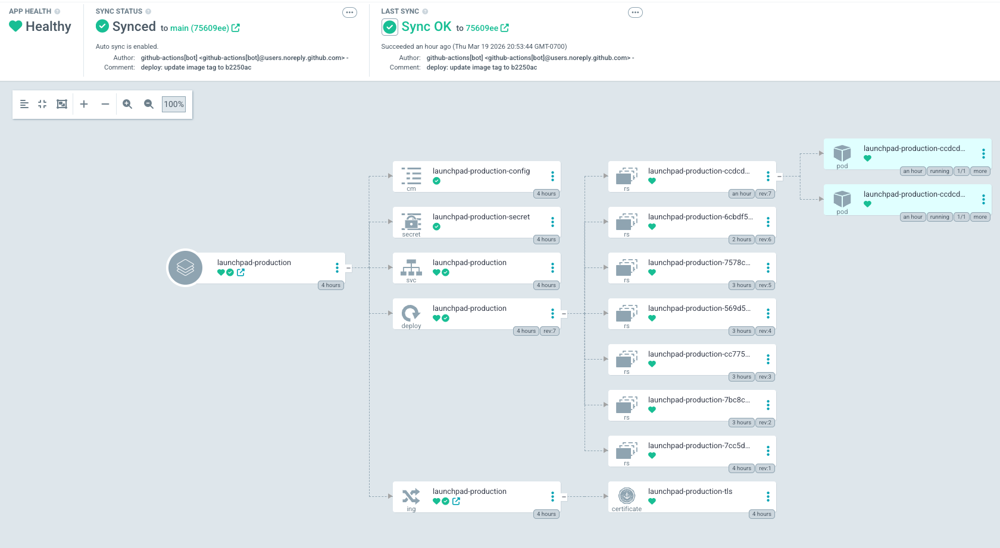
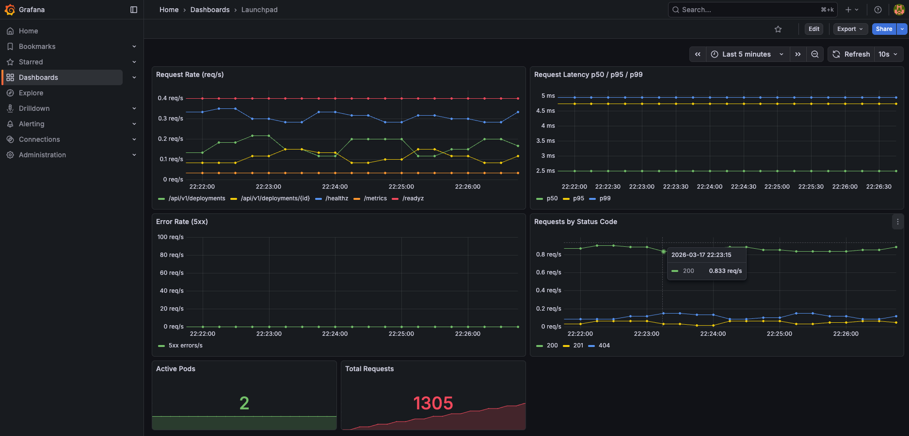
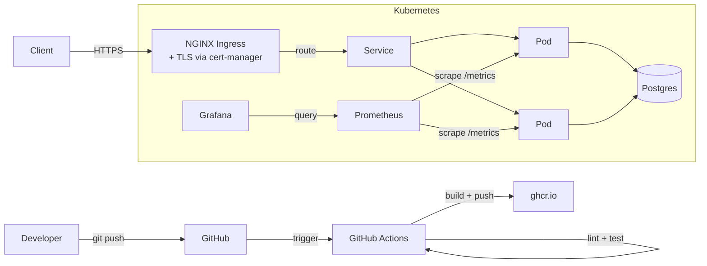
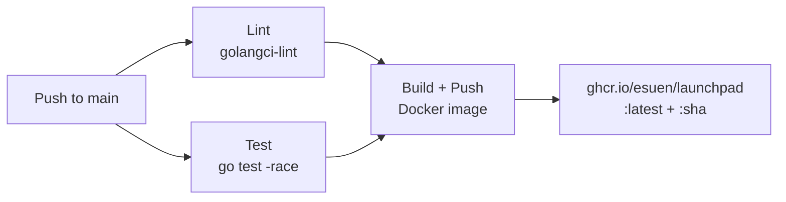
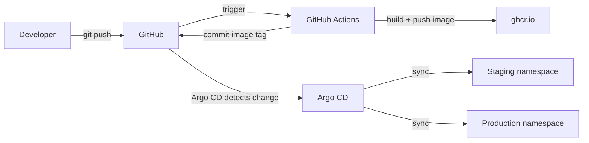

# Launchpad

A deployment tracker API built with Go, deployed to Kubernetes. Demonstrates a production-shaped cloud-native architecture: CI/CD, containerization, Helm-based deployment, Postgres, TLS ingress, and full observability with Prometheus and Grafana.

## GitOps





## Observability



## Architecture



## CI/CD Pipeline



## API

| Method | Path | Description |
|--------|------|-------------|
| `POST` | `/api/v1/deployments/` | Create a deployment record |
| `GET` | `/api/v1/deployments/` | List deployments (filter: `?service=`, `?environment=`) |
| `GET` | `/api/v1/deployments/{id}` | Get a deployment by ID |
| `GET` | `/healthz` | Liveness probe |
| `GET` | `/readyz` | Readiness probe |
| `GET` | `/metrics` | Prometheus metrics |

### Example

```bash
# Create a deployment
curl -sk -X POST https://launchpad.local/api/v1/deployments/ \
  -H "Content-Type: application/json" \
  -d '{"service_name":"api-server","version":"v1.0.0","environment":"production"}'

# List deployments
curl -sk https://launchpad.local/api/v1/deployments/

# Filter by environment
curl -sk https://launchpad.local/api/v1/deployments/?environment=production
```

## Project Structure

```
├── cmd/server/              # Entrypoint, config, graceful shutdown
├── internal/
│   ├── database/            # Postgres connection, migrations
│   │   └── migrations/      # SQL migration files
│   ├── model/               # Domain types (Deployment, status constants)
│   ├── server/              # HTTP handlers, middleware, routing
│   └── store/               # Store interface, Postgres + in-memory implementations
├── deploy/
│   ├── helm/launchpad/      # Helm chart (Deployment, Service, Ingress, Secret, ConfigMap)
│   ├── kind-config.yaml     # kind cluster config with ingress port mappings
│   └── grafana-dashboard.json
├── .github/workflows/       # CI pipeline
├── Dockerfile               # Multi-stage build (golang:alpine → alpine)
└── Makefile                 # Build, test, lint, docker, helm, observability targets
```

## Getting Started

### Prerequisites

- Go 1.25+
- Docker
- kind
- kubectl
- Helm

### Deploy to kind

```bash
# Create cluster with ingress support
kind create cluster --name launchpad --config deploy/kind-config.yaml

# Install infrastructure
helm repo add bitnami https://charts.bitnami.com/bitnami
helm repo add prometheus-community https://prometheus-community.github.io/helm-charts
helm repo add grafana https://grafana.github.io/helm-charts
helm repo update

# Install NGINX ingress controller
kubectl apply -f https://raw.githubusercontent.com/kubernetes/ingress-nginx/main/deploy/static/provider/kind/deploy.yaml

# Install cert-manager
kubectl apply -f https://github.com/cert-manager/cert-manager/releases/download/v1.17.2/cert-manager.yaml

# Install Postgres
helm install postgresql bitnami/postgresql \
  --set auth.username=launchpad --set auth.password=launchpad --set auth.database=launchpad

# Install Prometheus
helm install prometheus prometheus-community/prometheus \
  --set alertmanager.enabled=false --set prometheus-node-exporter.enabled=false \
  --set prometheus-pushgateway.enabled=false --set kube-state-metrics.enabled=false

# Install Grafana
helm install grafana grafana/grafana --set adminPassword=admin \
  --set persistence.enabled=false \
  --set datasources."datasources\.yaml".apiVersion=1 \
  --set datasources."datasources\.yaml".datasources[0].name=Prometheus \
  --set datasources."datasources\.yaml".datasources[0].type=prometheus \
  --set datasources."datasources\.yaml".datasources[0].url=http://prometheus-server \
  --set datasources."datasources\.yaml".datasources[0].access=proxy \
  --set datasources."datasources\.yaml".datasources[0].isDefault=true

# Install Argo CD
kubectl create namespace argocd
kubectl apply -n argocd -f https://raw.githubusercontent.com/argoproj/argo-cd/stable/manifests/install.yaml --server-side --force-conflicts

# Build and load app image
make docker-build
kind load docker-image ghcr.io/esuen/launchpad:latest --name launchpad

# Apply standalone resources
kubectl create namespace staging
kubectl create namespace production
kubectl apply -f deploy/clusterissuer.yaml

# Deploy via Argo CD
kubectl apply -f deploy/argocd/staging.yaml
kubectl apply -f deploy/argocd/production.yaml

# Add hosts entries (requires sudo)
echo '127.0.0.1 launchpad.local' | sudo tee -a /etc/hosts
echo '127.0.0.1 staging.launchpad.local' | sudo tee -a /etc/hosts

# Verify
curl -sk https://launchpad.local/healthz
curl -sk https://staging.launchpad.local/healthz
```

### Run Locally (no Kubernetes)

```bash
make run  # starts with in-memory store (no Postgres needed)
```

### Run Tests

```bash
make test
```

### All Make Targets

| Target | Description |
|--------|-------------|
| `make build` | Build Go binary |
| `make run` | Run locally |
| `make test` | Run tests with race detector |
| `make lint` | Run golangci-lint |
| `make docker-build` | Build Docker image |
| `make docker-run` | Run Docker container locally |
| `make helm-lint` | Lint Helm chart |
| `make helm-template` | Render Helm templates |
| `make helm-install` | Deploy to current K8s context |
| `make helm-uninstall` | Remove from K8s |
| `make grafana` | Port-forward Grafana (http://localhost:3000) |
| `make prometheus` | Port-forward Prometheus (http://localhost:9090) |
| `make argocd` | Port-forward Argo CD UI (https://localhost:8443) |

## GitOps Deployment Flow



Argo CD watches the repo and automatically syncs both environments when the Helm chart or values files change. CI builds the image, pushes it to ghcr.io, then commits the new image tag back to git — Argo CD picks up the commit and deploys.

### Environments

| Environment | Namespace | Host | Replicas | Values file |
|-------------|-----------|------|----------|-------------|
| Staging | `staging` | `staging.launchpad.local` | 1 | `values-staging.yaml` |
| Production | `production` | `launchpad.local` | 2 | `values-production.yaml` |

## Production vs Local Tradeoffs

This project runs locally on kind. In a production environment, you'd make these changes:

| Component | Local (this project) | Production |
|-----------|---------------------|------------|
| Kubernetes | kind (single node) | Managed K8s (EKS, GKE, AKS) |
| Container registry | ghcr.io | ECR, GCR, or private registry |
| TLS certificates | Self-signed (cert-manager) | Let's Encrypt via cert-manager (same setup, swap ClusterIssuer) |
| Database | Postgres in-cluster (Bitnami Helm chart) | Managed database (RDS, Cloud SQL) |
| Secrets | Kubernetes Secrets (base64) | Sealed Secrets, External Secrets Operator, or Vault |
| Environments | Namespaces in same cluster | Separate clusters per environment |
| DNS | /etc/hosts entries | Real DNS (Route 53, Cloud DNS) |
| Observability | Self-hosted Prometheus + Grafana | Datadog, Grafana Cloud, or managed Prometheus |
| Image pull | `kind load` (local) | Pull from registry (standard) |
| Argo CD access | port-forward | Ingress with SSO/OAuth |
| GitOps sync | Polling (3 min interval) | GitHub webhook for near-instant sync |

The architecture and patterns are identical — managed services replace self-hosted components for operational efficiency.

## Roadmap

- **Phase 1**: Go API, Docker, Helm, kind, GitHub Actions CI
- **Phase 2**: Postgres, ingress + TLS, secrets, Prometheus + Grafana
- **Phase 3** (current): Argo CD, GitOps deployment flow, environment separation
- **Phase 4**: Argo Rollouts, policy enforcement, OpenTelemetry
